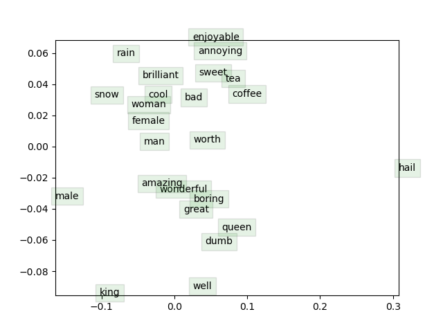

# AI intro Assignment GR09 - Word2vec

## Result



## How to train

1. Create env

```bash
conda env create -f env.yml
conda activate ai-intro-env
```

2. Download dataset

```bash
sh get_datasets.sh
```

3. Train

```bash
python run.py
```

## Author

1. Nguyễn Đình Hiếu - 20215049
2. Hoàng Đức Gia Hưng - 20215062
3. Mai Minh Khôi - 20210492
